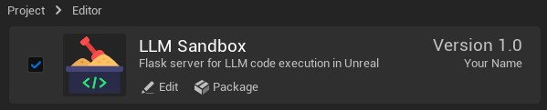

# LLM Sandbox Unreal - Setup

Follow these steps to install and initialize the LLM Sandbox Unreal plugin.

## Installation

1. Copy the `LLMSandbox` folder into your project’s `Plugins/` directory

2. Open Unreal Engine (or restart)

3. Open `Edit → Plugins` and enable:
   - **Python Editor Script Plugin**
   - **Python Foundation Packages**
   - **LLM Sandbox**
     

4. Restart Unreal Engine

5. Find the new menu `LLM Sandbox Tools`, click: `LLM Sandbox Tools -> Install Dependencies`
   - Installs required Python packages into the project:
     - `fastcore` 
     - `flask`
     - `ipython`
     - `lisette`

6. Restart Unreal Engine

## Initialization
 1. In Unreal click `LLM Sandbox Tools -> Start Server`
 2. Follow instructions at [LLM Sandbox Web Interface](https://github.com/NeuralVFX/llm-sandbox-ui) to start Web Interface
 3. Check [USAGE](docs/USAGE.md) for notebook usage directions
