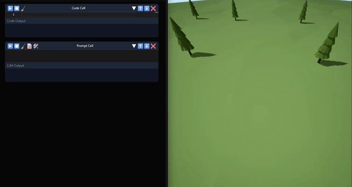

# LLM Sandbox - Custom Agentic Tools

Tools can be registered by either adding a file to a search directory, or running commands in a code cell.
- Both require the `@register_tool` decorator for the LLM to see them

## Search Dir
- Put a python file containing your tools inside `PluginDir/Content/Python/default_tools` or `ProjectDir/Content/Python/tools`
- This is like a permanant tool

## Code Cell
- Execute the function directly in a `Code Cell`
- Tools registered in `Code Cells` are instantly availible to the LLM
- This will last until you restart the server
- This is the best way to test/prototype a tool, before making it permanent
  


## Syntax to Register

#### Simple Tool:
```python
# Simple tool - no patches needed
@register_tool
def spawn_cube(
    x: float,  # X world coordinate
    y: float,  # Y world coordinate
    z: float   # Z world coordinate
):
    """Spawn a cube at the specified location."""
    # Your implementation here
    pass
```

#### Tool with specific Schema overrides: 
```python
# Tool with schema patch - enforces array constraints
ACTOR_PATHS_PATCH = {'type': 'array', 'items': {'type': 'string'}, 'minItems': 1}

@register_tool(patches={'actor_paths': ACTOR_PATHS_PATCH})
def delete_actors(
    actor_paths: List[str]  # List of actor paths to delete
):
    """Delete the specified actors from the level."""
    # Your implementation here
    pass
```

## To use:
- Open a `Prompt Cell`, Click the 🛠️ icon to activate Unreal tools, and write a prompt!

## View the tool Schema
Schemas are stored in a global variable `TOOL_SCHEMAS`, printing it should show something like:
```python
[{'type': 'function',
  'function': {'name': 'move_actor_until_hit',
   'description': '\n    Drop actors onto surfaces below (or in any direction).\n ',
   'parameters': {'type': 'object',
    'properties': {'actor_paths': {'type': 'array',
      'description': 'REQUIRED. Non-empty list of Actor UObject paths (strings). Never pass an empty list.',
      'items': {'type': 'string'},
      'minItems': 1},
     'distance': {'type': 'number', 'description': '', 'default': 10000},
     'buffer_distance': {'type': 'number',
      'description': '',
```

