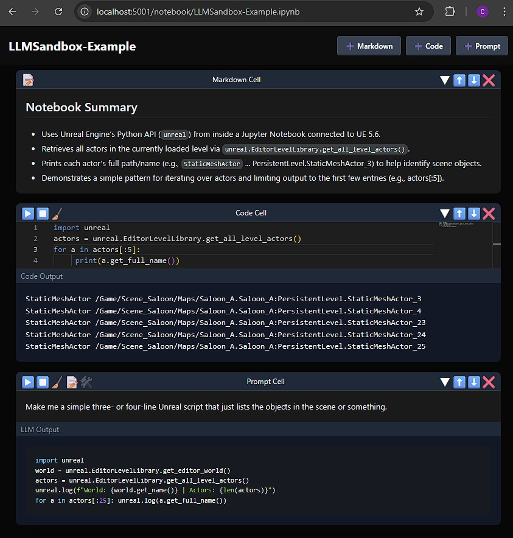
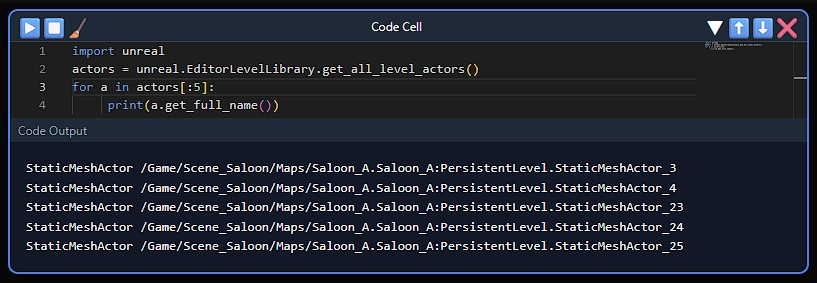
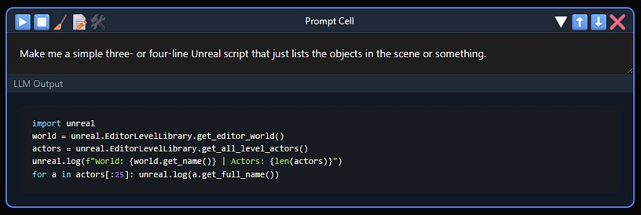
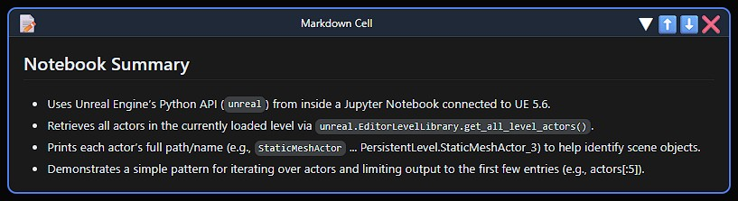

# LLM Sandbox — Usage

The web interface provides a Jupyter-style notebook with three cell types:

- **Code Cells** — Execute Python directly inside Unreal Engine
- **Prompt Cells** — Send prompts to an LLM with full notebook context
- **Markdown Cells** — Write notes using Markdown

Notebooks use the standard `.ipynb` format and are compatible with Jupyter.

# Cell Types

## Code Cell

Runs Python code directly inside the Unreal Engine Python kernel.

**Behavior**
- Variables persist across cells
- Tools can be registered using `@register_tool`
- `print()` output and errors appear at the bottom of the cell

**Controls**
- ▶ — Run the cell
- ⏹ — Interrupt execution
- 🧹 — Clear output

## Prompt Cell

Sends a prompt to an LLM.

**Context**
- The LLM sees all cells *above* the prompt cell
- Includes code, output, and error messages  
  *(especially useful for debugging)*

**Controls**
- ▶ — Send the prompt
- ⏹ — Interrupt LLM output
- 🧹 — Clear output
- 📝 — Toggle edit vs rendered Markdown
- 🛠 — Toggle Unreal tool usage

⚠️**Unreal Tool Usage**⚠️
- 🛠 must be enabled for the LLM to see the Unreal tools
- Otherwise it can use generic web-search tools only

## Markdown Cell

Used for notes and documentation.

**Behavior**
- Displays rendered Markdown when not editing

**Controls**
- 📝 — Toggle edit vs rendered Markdown

# Opening, Saving, and Renaming Notebooks

### Opening a Notebook

Navigate directly to a notebook URL: `http://localhost:5001/notebook/NotebookName.ipynb` 
- If the notebook exists, it will be opened
- If it does not exist, a new notebook will be created

### Autosave

- Notebooks autosave every **5 seconds**
- No manual save is required

### Renaming a Notebook

- Click the notebook title in the left sidebar
- Enter a new name
- Future autosaves will go to the new name (the original notebook file is not deleted)

# Managing Cells

### Adding a Cell

Use the **➕ Buttons** in the upper-right of the notebook:

- The new cell is added to the bottom of the notebook
- *(Future)* Option to insert below the currently selected cell

### Organizing Cells

- ▼ - Minimize / Maximize
- ⬆⬇ - Move Up / Move Down
- ❌ - Delete**

